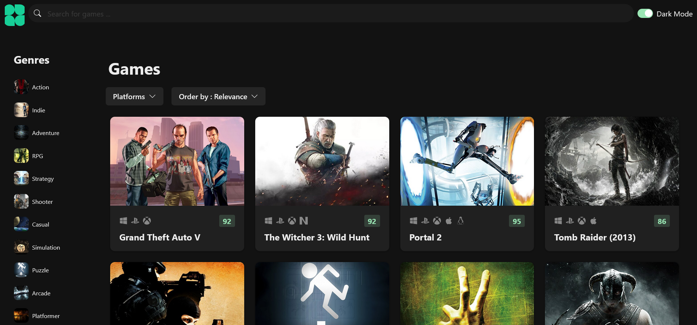
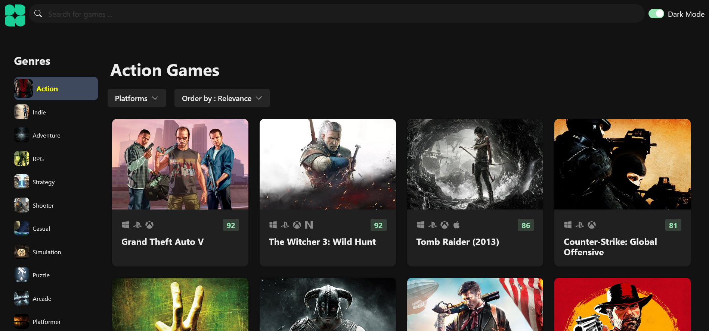
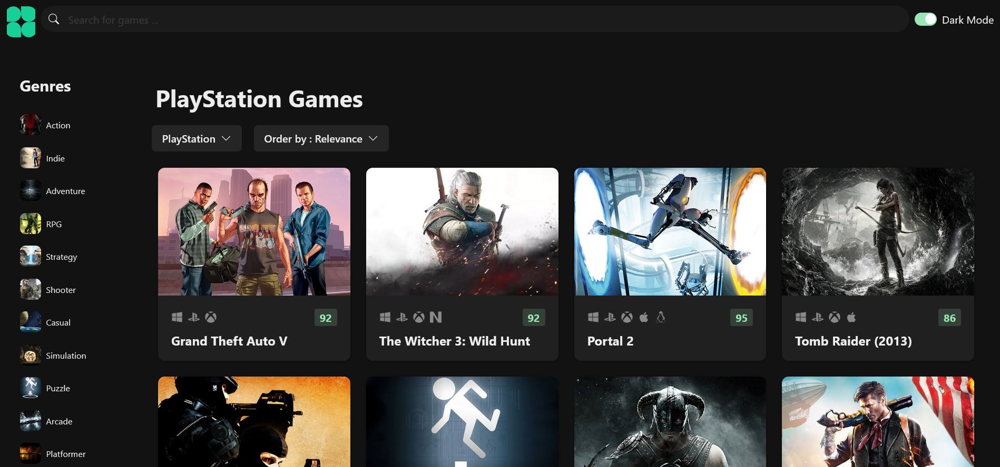
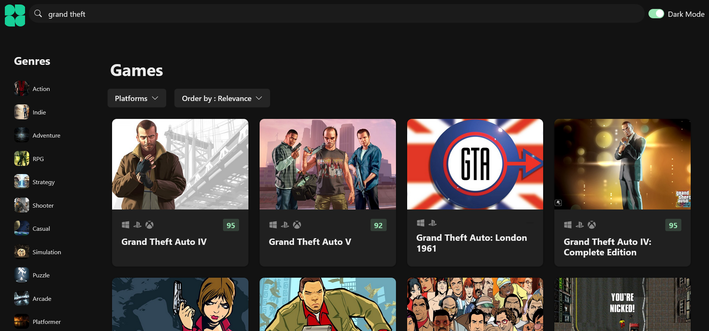
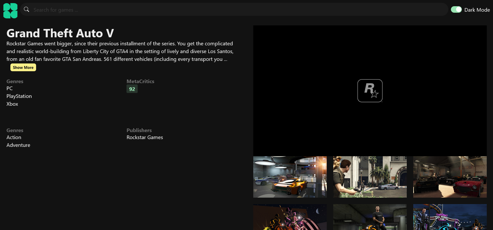

# Frontend Mentor - Results summary component solution

This is a solution to the [Results summary component challenge on Frontend Mentor](https://www.frontendmentor.io/challenges/results-summary-component-CE_K6s0maV). Frontend Mentor challenges help you improve your coding skills by building realistic projects.

## Table of contents

- [Overview](#overview)
  - [Screenshot](#screenshot)
  - [Links](#links)
- [My process](#my-process)
  - [Built with](#built-with)
  - [What I learned](#what-i-learned)
- [Author](#author)

**Note: Delete this note and update the table of contents based on what sections you keep.**

## Overview

### Screenshot

Home Page.

You can List Games by Choosing Genre.

You can List Games by Choosing Platform.

You can Search Games.

Geme Detail page.

### Links

- Site Preview URL: [Add live site URL here](https://game-hubb.netlify.app/)

## My process

### Built with

- [React](https://react.dev/) - JS library
- [TypeScript](https://www.typescriptlang.org/docs/) - JavaScript with syntax for types.
- [Chakra Ui](https://chakra-ui.com/) - For styles

**Note: These are just examples. Delete this note and replace the list above with your own choices**

### What I learned

- Improve skills in working with React.

- Learning and practice Typescript.

- working with React usuful pakages like :

  - React Router Dom
  - React Query
  - Axios
  - Zustand as simple sate managment
  - Context Api

## Author

- Twitter - [@yourusername](https://www.twitter.com/AliM2177)
